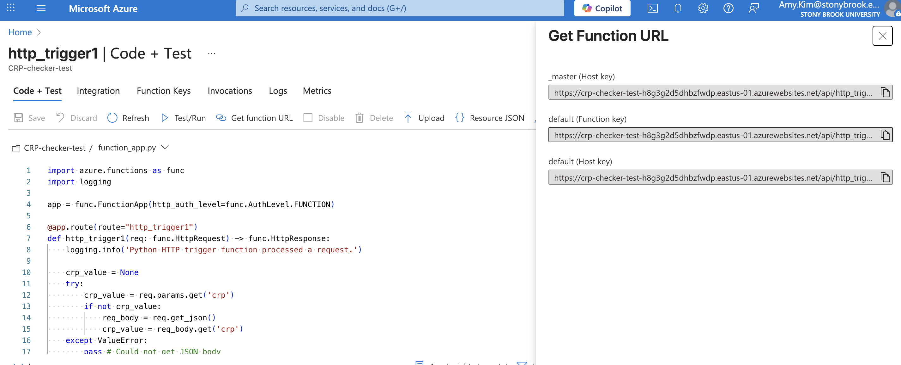
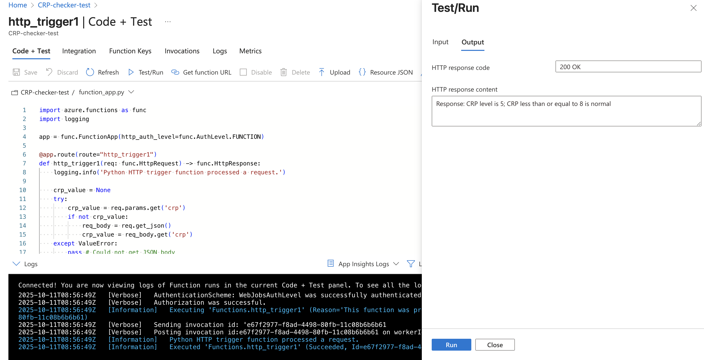
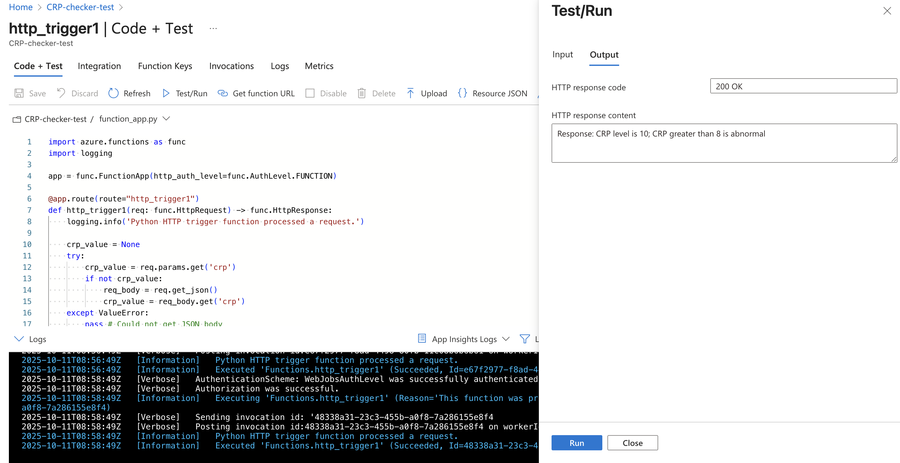

# assignment3_cloud_functions
504 assignment 3 - cloud functions

Link to recording: 

## Lab Rules - C-reactive Protein (CRP)
I chose to use CRP for this assignment. CRP is a lab-value that is an inflammatory marker. It is a protein produced by the liver that increases if the body produces inflammation due to infection. It can be checked via a simple blood test. It is measured in miligrams per liter (mg/L). Results that are > 8 is considered high/abnormal.
Citation:
https://www.mayoclinic.org/tests-procedures/c-reactive-protein-test/about/pac-20385228 

## Google Cloud Platform
Region: europe-west1

Endpoint URL: https://crp-value-checker-872931411598.europe-west1.run.app 

### Deployment commands/steps executed:

#### Screenshot showing functionality that have your custom URLs, along with outputs:

#### Example requests invocations that work as shown in video:
Normal:

Abnormal:

## Azure
Region: east-US

Endpoint URL: https://crp-checker-test-h8g3g2d5dhbzfwdp.eastus-01.azurewebsites.net/api/http_trigger1?code=yMFPEoOI7xDw9sxUFqoeeThk02uSase4uOervOJ6mYkqAzFu9TeNZw==

### Deployment commands/steps executed:

Screenshots showing functionality that have your custom URLs:

#### Example requests invocations that work as shown in your video:
Normal:

Abnormal:

## Short comparison paragraph of the two clouds
While both Azure Functions and Google Cloud Functions were straightforward to set up and deploy, I found Azure to be slightly more beginner-friendly. A key reason for this was the ability to test the function directly within the same page in the Azure portal, which streamlined the development process. In contrast, testing with Google Cloud Functions often required navigating back and forth between different pages to make changes and then test them, which felt less integrated. Furthermore, for Google Cloud Functions, there seemed to be a longer delay for code changes to be saved and become available for testing in Google Colab after each modification