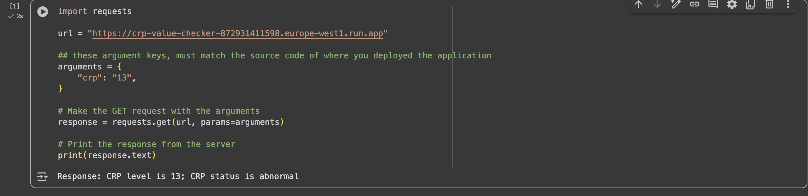

# assignment3_cloud_functions
504 assignment 3 - cloud functions

Link to recording: 

## Lab Rules - C-reactive Protein (CRP)
I chose to use CRP for this assignment. CRP is a lab-value that is an inflammatory marker. It is a protein produced by the liver that increases if the body produces inflammation due to infection. It can be checked via a simple blood test. It is measured in miligrams per liter (mg/L). Results that are > 8 is considered high/abnormal.
Citation:
https://www.mayoclinic.org/tests-procedures/c-reactive-protein-test/about/pac-20385228 

## Google Cloud Platform
Region: europe-west1

Endpoint URL: https://crp-value-checker-872931411598.europe-west1.run.app 

### Deployment commands/steps executed:

#### Screenshot showing functionality that have your custom URLs, along with outputs:

#### Example requests invocations that work as shown in video:
Normal:

Abnormal:

## Azure
Region: east-US

### Deployment commands/steps executed:

Screenshots showing functionality that have your custom URLs, along with outputs

Public endpoint URLs (+ notes on auth: unauthenticated vs key‑based).

Example requests invocations that work as shown in your video.

## Short comparison paragraph of the two clouds
